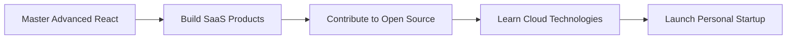

<div align="center">

# 🚀 Mohammad Ahmad Ansari

### Full Stack Developer | MERN Stack Specialist | AI/ML Enthusiast


[](https://linkedin.com/in/ansarimd) 
[](mailto:mohammad.hmd.ansari@gmail.com) 
[](https://github.com/ansarimohammad)
[](#)

</div>

---

## 💡 About Me

```javascript
const mohammad = {
    role: "Full Stack Developer",
    education: "B.Tech CSE (AI/ML) - Final Year",
    location: "Navi Mumbai, India",
    specialization: ["MERN Stack", "Web Development", "Real-World Solutions"],
    currentFocus: "Building impactful applications that solve real problems",
    achievements: ["Smart India Hackathon Finalist", "NPTEL Certified"],
    lifePhilosophy: "Code with purpose, build with passion 💻✨"
};
```

🎯 **What I Do:**
- 🌐 Develop full-stack web applications using MERN stack
- 🏢 Build real-world solutions like NGO platforms & legal education systems
- 🤝 Collaborate on projects that create social impact
- 📚 Continuously learning and exploring new technologies

---

## 🛠️ Tech Arsenal

<div align="center">

### Frontend Magic ✨


### Backend Power ⚡


### Languages & Tools 🔧


</div>

---

## 🎨 Featured Projects

<div align="center">

| Project | Description | Tech Stack | Links |
|---------|-------------|------------|-------|
| 📚 **LawLevelUp Online** | Legal education platform with secure auth & dynamic content | Next.js, MongoDB, Clerk | [View](#) |
| 🤝 **Alight India Foundation** | Responsive NGO website for social impact | HTML, CSS, JavaScript | [View](#) |
| 🏢 **Apartment Management** | Complete property management system | MySQL, PHP, JavaScript | [View](#) |

</div>

---

## 📊 GitHub Analytics

<div align="center">
  


</div>

<div align="center">
  
[](https://git.io/streak-stats)

</div>

---

## 🏆 Achievements & Certifications

<div align="center">

| 🥇 Achievement | 📅 Year |
|----------------|---------|
| Smart India Hackathon Finalist | 2024 |
| NPTEL - Programming with Generative AI | 2024 |
| Web Development Internship - LawLevelUp | 2025 |

</div>

---

## 💼 Professional Experience

<table>
<tr>
<td width="50%">

### 🚀 Web Developer Intern
**LawLevelUp** | *May 2025 - Jul 2025*

- Built full-stack features with Next.js & MongoDB
- Led frontend & backend development
- Collaborated using Agile methodology
- Participated in code reviews & debugging

</td>
<td width="50%">

### 🎓 Education
**B.Tech CSE (AI/ML)**  
D Y Patil International University

**Duration:** 2022 - 2026

**Focus Areas:**
- Web Development
- Database Management
- AI/ML Integration

</td>
</tr>
</table>

---

## 📈 Contribution Graph

<div align="center">

[](https://github.com/ansarimohammad)

</div>

---

## 🎯 Current Goals for 2025



---

## 💬 Let's Connect!

<div align="center">

### 🌟 Open for Collaborations | Freelance Projects | Full-Time Opportunities

**"Building the future, one line of code at a time"**

📧 mohammad.hmd.ansari@gmail.com | 📱 +91 8928707201 | 📍 Navi Mumbai, India


---

### ⭐ If you like my work, consider giving a star to my repositories!

**Made with ❤️ by Mohammad Ahmad Ansari**

</div>
